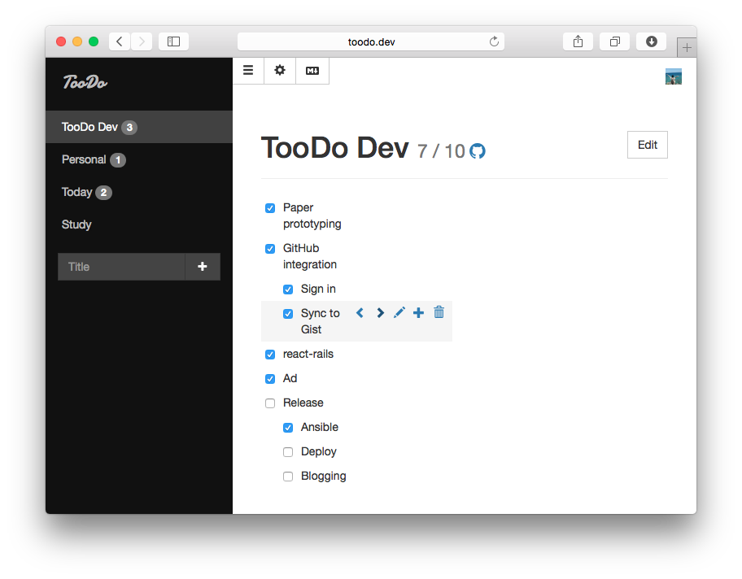

# TooDo [](https://circleci.com/gh/tnantoka/toodo) [](https://codeclimate.com/github/tnantoka/toodo) [](https://codeclimate.com/github/tnantoka/toodo/coverage)

Minimal task lists with Markdown and Gist. Powered by react-rails.  
http://toodo.tnantoka.com/



## Requirement

- Ruby 2.2
- Ruby on Rails 4.2
- GitHub API  
  (Authorization callback path: `/auth/github/callback`)

## Installation

```
# .env
GITHUB_CLIENT_ID="ID"
GITHUB_CLIENT_SECRET="SECRET"
```

## Development

### Capistrano

```
# .env
DEPLOY_HOST="HOST:PORT"
DEPLOY_USER="USER"

# Setup
$ bundle exec cap production deploy
$ bundle exec cap production db:create

# Deploy
$ bundle exec cap production deploy

# Drop
$ bundle exec cap production db:drop
```

### Screenshot

```
$ rake screenshot

# On Safari
javascript:resizeTo(800, 600)
```

## Author

[@tnantoka](https://twitter.com/tnantoka)

